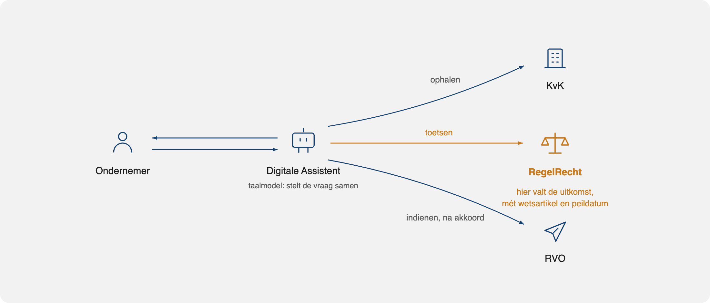
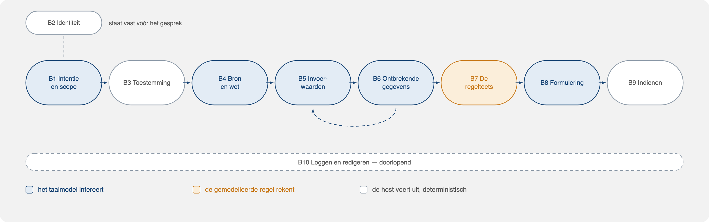
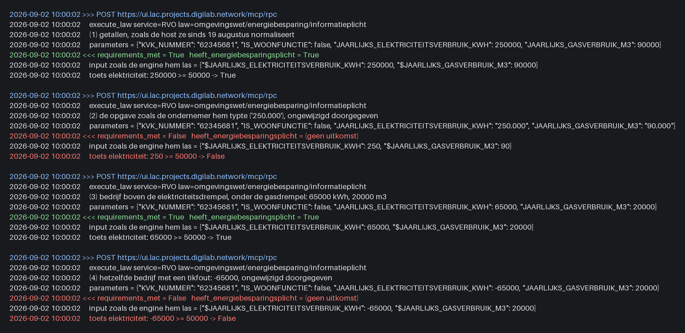
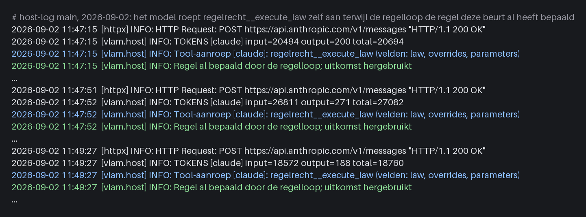
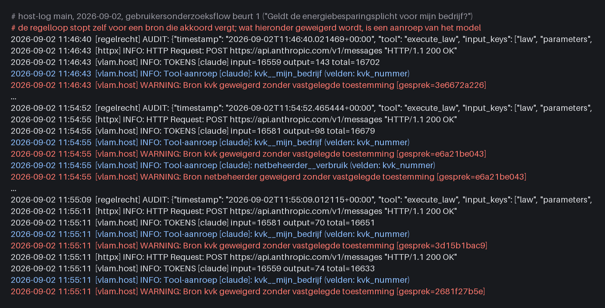
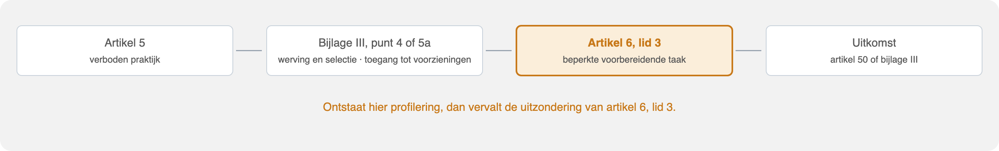
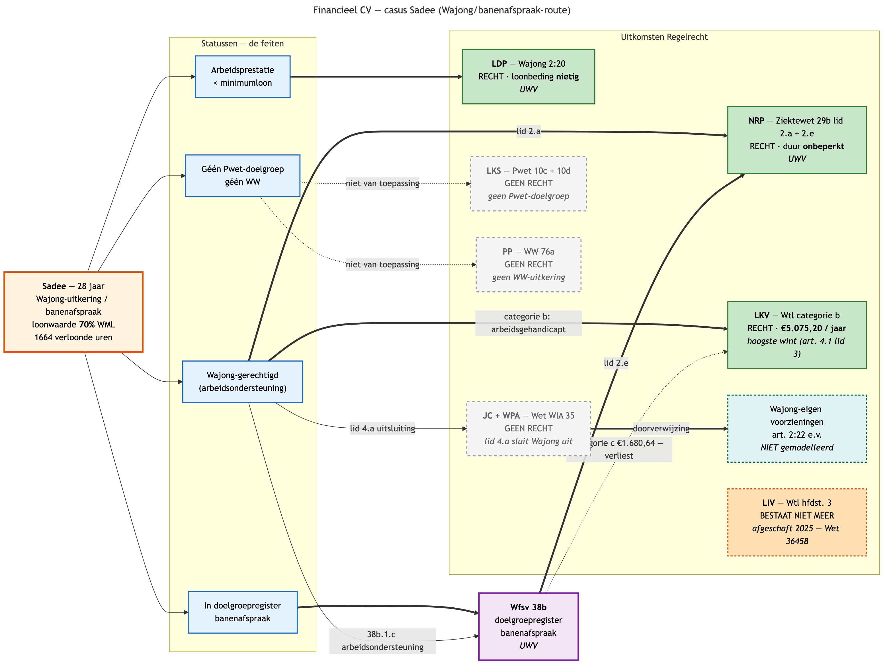

# PDR-014: De chat wordt geparkeerd tot de vertaling van vraag naar wet en invoer klopt; daarna doortrekken, eventueel in een andere vorm

| Veld | Waarde |
|---|---|
| Status | Voorgesteld (concept, nog niet vastgesteld) |
| Datum | 2026-09-02 |
| Beslisser(s) | Projectteam poc-moza; vaststelling door de MOZa-productgroep nog te plannen |
| Gerelateerd | [PDR-006](PDR-006-feasibility-conclusie.md), [PDR-008](PDR-008-generieke-regelrecht-tool-en-wallet.md), [PDR-011](PDR-011-foutmeldingen-catalogus.md), [PDR-013](PDR-013-timeoutgrenzen-op-basis-van-meting.md), het sessiedocument *Classificatie van de Digitale Assistent* (juridische toets 10 augustus 2026; werkdocument van het team, niet in deze repository), notities SZW-juristvalidatie 23 juli (repo `MinBZK/regelrecht`, `docs/financieel-cv/szw/2026-07-23-juristvalidatie-notities.md`, branch `feat/financieel_cv_RVO`) |

## Hoe dit document te lezen

Wie alleen de uitkomst wil, leest [Context](#context), [Beslissing](#beslissing)
en [Consequenties](#consequenties). De [Onderbouwing](#onderbouwing) bevat de
waargenomen gevallen, uit de code, de metingen en de twee juristensessies,
waarop de beslissing rust. Alles wat uit een sessie komt is samengevat door
het team; het zijn geen juridische oordelen.

## Context

De Digitale Assistent is gebouwd als chat: de ondernemer stelt een vraag, een
taalmodel bepaalt welke bron en welke wet daarbij horen, vertaalt wat de
ondernemer zegt naar de invoer die de regel nodig heeft, en RegelRecht rekent
de uitkomst uit met wetsartikel en peildatum. Dat laatste werkt. Sinds juni
(PDR-008) is de regeltoets deterministisch, herleidbaar en reproduceerbaar, en
in het gebruikersonderzoek van augustus (proefronde 20 augustus, sessies 25 en
27 augustus) hebben respondenten de informatieplicht-flow van vraag tot
ingediende rapportage doorlopen.

*Figuur 1. Waar de juridische toets valt: bij de gemodelleerde regel. Het
taalmodel zit ervoor en erna. Schema uit de sessie van 10 augustus.*

Het probleem zit niet bij de toets maar ervoor. Drie stappen liggen tussen de
vraag van de ondernemer en de aanroep van de engine, en alle drie zijn nu een
taak van het taalmodel:

1. **Welke wet** hoort bij deze vraag (in het sessiedocument van 10 augustus
   beslismoment B4).
2. **Welke invoerwaarden** heeft die wet nodig, en wat betekent wat de
   ondernemer zegt in de termen van de regel (B5).
3. **Welke gegevens** moeten nog worden uitgevraagd, en bij wie (B6).

*Figuur 2. De tien beslismomenten uit de sessie van 10 augustus. Blauw is het
taalmodel, amber de gemodelleerde regel, wit de host. De drie stappen hierboven
zijn B4, B5 en B6.*

In augustus is vrijwel al het werk aan de host besteed aan het inperken van
precies deze drie stappen: een feitenkaart zodat het model geen bedrijfsgegevens
meer hoeft over te tikken, een orkestratielus die de wet aanroept vóórdat het
model iets doet, een routeringstabel die per veld voorschrijft waar de waarde
vandaan komt, een harde poort in de host omdat de promptregel voor toestemming
niet hield. Elke stap die van het model naar de host verhuisde werd
betrouwbaarder. Wat overbleef voor het model, de vertaling van een vage vraag
naar wet en invoer, bleef de bron van de fouten.

De juridische toets van 10 augustus kwam onafhankelijk op hetzelfde punt uit.
Voorbereid als classificatie van tien beslismomenten onder de AI-verordening,
bleek de zwaarte niet te liggen bij B7, de regeltoets, maar bij de stappen die
het taalmodel zet, met B5 als het zwaarste moment.

De vorm maakt het lastiger om dit op orde te krijgen. In een chat formuleert
de ondernemer een vraag die het systeem daarna moet duiden, terwijl de regel al
precies weet welke gegevens hij nodig heeft. Zolang die duiding niet klopt,
bouwt elke verbetering aan het gesprek op een wankele stap. Daarom kiezen we
ervoor de gespreksvorm even te parkeren, eerst die stap kloppend te maken, en
het daarna door te trekken naar de ondernemer, in dezelfde of in een andere
vorm.

## De kloof tussen de vraag van de ondernemer en de wet

De vraag waarmee een ondernemer binnenkomt is abstract. De wet die het
antwoord bepaalt is gedetailleerd. Daartussen zit een trap van vijf treden, en
op elke trede wordt iets gekozen. In de chat zet het taalmodel alle vijf de
stappen, in één beurt, zonder dat iemand ze ziet.

| Trede | Wat er gekozen wordt | Arbeidsmarktcasus | Energiecasus |
|---|---|---|---|
| 1. Vraag | wat de ondernemer wil | "Ik wil iemand aannemen met een afstand tot de arbeidsmarkt. Wat zijn mijn mogelijkheden?" | "Moet ik iets met energiebesparing?" |
| 2. Regelingen | welke instrumenten in beeld komen | dertien instrumenten bij vier bestuursorganen (bijlage B van het sessiedocument), zeven gemodelleerd | drie plichten: energiebesparings-, informatie- en onderzoeksplicht, plus de EED-audit |
| 3. Wet en artikel | de grondslag per instrument | Participatiewet 10c en 10d, Wtl 2.1, Ziektewet 29b, Wet WIA 35, Wajong 2:20 en 2:22, WW 76a, Wfsv 38b | Bal 5.15 en 5.15d; gemeentelijke bevoegdheid |
| 4. Formele begrippen | de categorieën waarin de wet denkt | doelgroep (minstens zes), loonwaarde, doelgroepregister, uitkeringssoort, Wajong-regime, arbeidsduur | verbruik per locatie, woonfunctie, "telen in kassen" (Bal 3.205), aardgasequivalent |
| 5. Parameters | wat de engine krijgt, met type en eenheid | `overeengekomen_arbeidsduur_uren_per_week = 32`, `loonwaarde_eurocent_per_maand = 129300` | `JAARLIJKS_ELEKTRICITEITSVERBRUIK_KWH = 250000`, `IS_WOONFUNCTIE = false` |

De verkeerde waarde op trede 5 is nog het kleinste probleem: die valt op
zodra de uitkomst wordt nagerekend, en de host normaliseert hem inmiddels. De
schade zit hoger op de trap, en heeft twee vormen.

**Toezeggingen vóórdat de toets heeft gedraaid.** De eerste beurt raakt per
ontwerp geen bron met gegevens over de ondernemer aan (toestemming eerst,
PDR-008); de wet draait er wel al met lege parameters, en een openbare
regelingenlijst mag. Wat de assistent in die beurt over de situatie van de
ondernemer zegt, is dus puur model. Dat het daar meestal goed gaat, is
gemeten: in 37 eerste beurten op 2 september (flow en losse vragen, oude en
nieuwe host) stond geen enkele uitspraak over wat geldt, een bedrag, een
termijn of een indiening die niet uit een bron kwam of van een voorbehoud was
voorzien. Dat het níet altijd goed gaat, is ook gemeten: "Uw rapportage is
ingediend" in de beurt die nog om bevestiging vroeg (13 augustus), en twee
verschillende deadlines afhankelijk van de bron (24 augustus). De grens wordt
bewaakt door een promptregel ("Geef NOOIT specifieke bedragen, deadlines of
termijnen tenzij deze direct uit een tool-resultaat komen"), en een
promptregel houdt meestal. Op 10 augustus lag de vraag op tafel of één
uitspraak van een overheidskanaal die er doorheen glipt, gerechtvaardigd
vertrouwen wekt.

**Het duurt lang voordat duidelijk is welke wet moet draaien.** De trap wordt
in de chat per beurt afgedaald. De ondernemer stelt een vraag, krijgt een
verduidelijkingsvraag of een toestemmingsvraag, geeft antwoord, en pas
daarna kiest het model een wet, roept een bron aan, en soms nog een.
Gemeten op 2 september: op de host van 13 augustus (het model orkestreert)
leest de ondernemer de uitkomst in beurt 2, na een modelbeurt van 18 tot 40
seconden waarin twee bronnen en de toets in één keer draaien; op de huidige
host (de regel stuurt) leest hij de uitkomst in beurt 3, na mediaan 16
seconden per beurt en 95 tot 163 seconden per doorloop. De engine zelf doet
er 60 milliseconden over. Vrijwel alle tijd zit in het model en het gesprek
eromheen. Als het model de verkeerde regeling zoekt, een regel opnieuw start
of dezelfde vraag herhaalt, schuift dat verder op, en de ondernemer ziet
intussen alleen een assistent die iets aan het uitzoeken is. Het moment
waarop vaststaat welke regeling met welke gegevens wordt getoetst is in de
chat niet zichtbaar en niet gegarandeerd.

De onderbouwing laat daarnaast zien dat de fouten op elke trede vallen, en
dat alleen de onderste trede door iets anders dan het model wordt
gecontroleerd:

- **Trede 2 en 3.** Het model zocht de RVO-regeling op een zoekterm die niet
  matchte en zette de maatregelenregel in op eigen initiatief. Op 10 augustus:
  "de verkeerde wet met een kloppende uitkomst". Modelkennis over welke
  regelingen bestaan is bovendien verouderd (vier van dertien dit jaar
  gewijzigd).
- **Trede 4.** "Afstand tot de arbeidsmarkt" is geen juridische categorie; de
  keuze voor een doelgroep is de normatieve stap, en die maakt het model.
  "Hij werkt vier dagen" wordt `overeengekomen_arbeidsduur_uren_per_week = 32` en scheelt elf procent subsidie. "Kas"
  in de SBI-omschrijving wordt "telen in kassen", een afleiding die de host nu
  doet en de ondernemer mag corrigeren.
- **Trede 5.** `"250.000"` wordt 250 (figuur 3). Een verzonnen override wordt
  wetsinvoer. Dit is de enige trede waar de engine zelf iets controleert
  (type, verplichte velden), en zelfs daar komt een verkeerd getal door: de
  engine meldt geen ontbrekend veld, alleen dat aan de voorwaarden niet is
  voldaan, en dat leest de keten als "de plicht geldt niet".

De omgekeerde richting bestaat al en is wél gecontroleerd. Van trede 5 naar
trede 1 loopt de route die PDR-008 beschrijft: de regelhouder vertaalt elke
voorwaarde uit de wet naar een parameter met een `description`, en die
beschrijving is de vraag die de ondernemer ziet ("Heeft het bedrijf een
koel- of vriesinstallatie?"). Dat is mensenwerk, gevalideerd door een jurist,
en het levert per regeling een vaste lijst velden op. De routeringstabel voegt
daar de bron per veld aan toe.

Daarom gaat de trap andersom. Niet: de ondernemer formuleert bovenaan en het
model daalt af tot de parameters. Maar: de regel staat onderaan vast, de
velden en bronnen zijn per regeling vastgelegd, en het portaal klimt op naar
de ondernemer met een ingevulde uitkomst en bij elk veld de reden waarom de
wet erom vraagt. De treden 2 tot en met 4 worden dan geen inferentie meer:

| Trede | Nu | Straks |
|---|---|---|
| 2. Regelingen | het model duidt de vraag | een toepassingsbereikregel op registratiegegevens (sector, omvang) bepaalt welke regelingen "mogelijk van toepassing" zijn; de ondernemer kiest uit die lijst |
| 3. Wet en artikel | het model kiest de tool en de wetnaam | ligt vast in de regelingsdefinitie |
| 4. Formele begrippen | het model vertaalt spreektaal | komt uit de bronhouder (doelgroepregister bij UWV, loonwaarde bij de gemeente) of uit een veld met de vraagtekst van de regelhouder; nooit uit vrije tekst over een derde |
| 5. Parameters | het model vult `overrides` | de host, via de routeringstabel, met normalisatie per veldtype |

Wat overblijft voor de ondernemer is trede 1, en die wordt een keuze uit een
lijst in plaats van een zin die geduid moet worden. Dat is de reden dat de
chat geparkeerd wordt: niet omdat het gesprek slecht is, maar omdat het
gesprek de ondernemer bovenaan de trap laat beginnen, terwijl alles wat we
kunnen controleren onderaan staat.

## Beslissing

1. **Eerst zorgen dat de vertaling van vraag naar wet en invoerwaarden
   klopt, buiten het taalmodel om.**
   Per regeling worden de wet, de benodigde velden en de bron per veld vooraf vastgelegd, in de vorm die de
   routeringstabel van `regelrouting.py` nu al heeft voor de informatieplicht.
   Wat niet in die tabel staat, komt niet bij de engine. Zolang deze stap niet
   aantoonbaar klopt, is er geen stap waarin een model uit spreektaal afleidt
   welke regeling of welke formele categorie bedoeld wordt (treden 2 tot en
   met 5 van de [trap hierboven](#de-kloof-tussen-de-vraag-van-de-ondernemer-en-de-wet)).

   Daaruit volgt een tweede regel: **geen toezegging vóór de toets.** Niets
   over wat geldt, welk bedrag, welke termijn of wat er is ingediend, voordat
   de regel of de bron het heeft bevestigd. Het eerste dat de ondernemer over
   zijn situatie leest, is een uitkomst van de regel, niet een verwachting
   van een model. En de regel draait als eerste, niet als sluitstuk: de tijd
   tussen "ik open dit" en "dit is getoetst" is één stap, geen gesprek.

2. **De chatvorm wordt geparkeerd, niet afgeschaft.** We bouwen er niet aan
   verder zolang de stap ervoor niet klopt; dat is een volgorde, geen oordeel
   over de chat. Wat we intussen wél bouwen is de basis die elke vorm nodig
   heeft: de regel, de velden, de bronnen en de toets die vooraf hetzelfde
   uitkomt als achteraf. Klopt die basis, dan trekken we hem door naar de
   ondernemer, in dezelfde of in een andere vorm.

   De werkhypothese voor die vorm is een **vooringevulde concept-aanvraag**:
   de ondernemer opent een regeling en ziet een uitgerekende uitkomst op
   gegevens die de overheid al heeft, met bij elk gegeven de bron en de
   ophaaldatum. Zijn werk is bevestigen of tegenspreken; tegenspreken leidt
   tot herberekenen. Werknaam **Digitale assistent 2.0** (de werknaam
   "Vooringevuld" is op 2 september losgelaten); in het portaal "Mijn
   regelingen"; op het scherm "Concept-aanvraag". Drie pijlers: het omgekeerde
   formulier, dezelfde toets vooraf als achteraf, en een berekening die
   traceerbaar is tot artikel en regelset-versie. Het is een hypothese: de
   schermschets wordt eerst met ondernemers getoetst.

3. **Wat uit de assistent blijft staan.** De regelloop en de routeringstabel,
   de feitenkaart met herkomst en soort per waarde, de toestemmingspoort per
   bron (PDR-008), de sessie-identiteit aan de host-kant (PDR-009), de sleutel
   van de gebruiker (PDR-010), de foutcatalogus (PDR-011) en de gemeten
   tijdgrenzen (PDR-013). Dat is de helft van de host die niets met de
   conversatie te maken heeft, en precies het deel dat in het onderzoek
   overeind bleef. Het probleemonderzoek uit de assistent-fase gaat mee. De
   kennis over dialoogontwerp (toon, taalniveau, formulieren in het gesprek,
   foutmeldingen) blijft bewaard in deze repository en komt van pas zodra de
   chat terugkomt, bijvoorbeeld als uitleglaag. Omdat de aanpak wijzigt, start
   het onderdeel bewust opnieuw in de fase Verkennen.

4. **De usecase wordt "als ondernemer iemand aannemen met een afstand tot de
   arbeidsmarkt"**, met het Financieel CV uit het RegelRecht-corpus als basis:
   harde criteria en bedragen per wetsartikel, zeven regelingen gemodelleerd,
   twee persona's (Koen en Sadee) doorgerekend. Eerste proef: één regeling met
   harde criteria, bij voorkeur de loonkostensubsidie (Participatiewet
   artikel 10c en 10d). Einddoel: een keten-demo end-to-end op de casus Sadee,
   op één regelset-versie, van wetsartikel tot ingediende concept-aanvraag.

5. **Welke rol chat en taalmodel daarna krijgen, staat open.** Denkbaar is
   een toelichting per veld ("waarom vraagt u dit?"), een uitleg van de
   uitkomst in gewone taal, of een gesprek bovenop een regelbasis die
   aantoonbaar klopt. Wat vaststaat: geen taalmodel op het pad van de
   ondernemer naar de invoer van de engine zolang die stap niet gecontroleerd
   is. De parkeerstand eindigt zodra aan het criterium in de vervolgstappen is
   voldaan.

6. **De eerste usecase wordt gebouwd als exemplaar, niet als uitzondering.**
   Alles wat per regeling nodig is, wordt vastgelegd in één declaratieve
   regelingsdefinitie die de routeringstabel, de bronnen en het scherm
   aanstuurt; per regeling komt er geen eigen code, prompt of scherm bij.
   Bij de tweede regeling meten we wat er echt nieuw was. Zie
   [Opschalen naar meerdere usecases](#opschalen-naar-meerdere-usecases).

## Opschalen naar meerdere usecases

De informatieplicht is gebouwd als één flow: een routeringstabel van acht
velden in `regelrouting.py`, een prompt die de regeling bij naam noemt (EBR-2026), en
formulieren die de frontend per regeling herkent. Dat schaalt niet: elke
volgende regeling zou dezelfde handmatige laag opnieuw vragen. De vraag "wie
schrijft de tabel" uit de onderbouwing is de schaalvraag. Het antwoord is een
vaste bouwvorm per regeling, met per onderdeel een eigenaar.

### Wat er per regeling nodig is

| Onderdeel | Wat het is | Eigenaar | Nu | Bij opschalen |
|---|---|---|---|---|
| **Regel** | de gemodelleerde wet in het RegelRecht-corpus, met versie en peildatum | regelhouder (departement), gevalideerd door een jurist | informatieplicht en maatregelen live; Financieel CV zeven regelingen gemodelleerd | ongewijzigd; per regeling een juristvalidatie zoals op 23 juli |
| **Velden** | welke invoer de regel nodig heeft, met vraagtekst en type | volgt uit de regel: de engine meldt zelf wat hij mist, de `description` per parameter is de vraag (PDR-008, punt 3) | werkt live | ongewijzigd; geen handwerk per regeling |
| **Veld → bron** | per veld: waar de waarde vandaan komt, welke soort (registratie, attestatie, opgave, wetsconstante), of toestemming nodig is, of de ondernemer mag corrigeren | portaalbeheer (MOZa), in overleg met de bronhouder | met de hand in Python, acht velden | een **bronnenregister** los van de regeling: per gegevenssoort één keer vastgelegd, hergebruikt door elke regeling die dat gegeven vraagt |
| **Bronnen** | een koppeling per bronhouder, met herkomst en toestemmingsscope | bronhouder | KvK, KOOP, RegelRecht, RVO, netbeheerder-mock | elke nieuwe bron één keer aansluiten (UWV: doelgroepregister; gemeente: loonwaarde); daarna beschikbaar voor elke regeling |
| **Uitvoerder** | de afspraak dat beoordelaar en portaal dezelfde regelset-versie draaien | uitvoerder en MOZa | geen | per regeling een schaduwdraai-afspraak; zonder die afspraak geen groene toets vooraf |
| **Scherm** | de concept-aanvraag: gegevens met bron en datum, uitkomst met artikel, bevestigen of tegenspreken | MOZa | formulierbouwer uit de routeringstabel en een rapport-event met herkomst bestaan al | één generieke weergave die uit de regelingsdefinitie wordt opgebouwd; geen scherm per regeling |
| **Toets** | scenario's met persona's die de uitkomst per regeling vastleggen | regelhouder en MOZa samen | BDD-scenario's in het corpus (Koen, Sadee); onderzoeksflow-script voor één flow | scenario's in het corpus zijn de maatstaf; het meetscript wordt generiek over de regelingsdefinitie |

De scheiding in de derde rij is de kern: **de wet weet wát ze nodig heeft, het
portaal weet wáár het vandaan komt.** De regel hoort niet te weten dat het
verbruik uit een Business Wallet komt, en het portaal hoort niet te weten
waarom artikel 5.15 Bal om verbruik vraagt. Dezelfde velden komen in veel
regelingen terug (KvK-nummer, SBI, vestigingsadres, arbeidsduur, uitkeringssoort);
staan ze eenmaal in het bronnenregister, dan kost een volgende regeling die
ze gebruikt geen nieuwe koppeling.

### Het schaalpad

1. **Eén regeling, hele keten.** Loonkostensubsidie op de casus Sadee/Koen:
   regel, velden, bronnen, uitvoerder, scherm, toets. Bewijst de bouwvorm.
2. **Tweede regeling in hetzelfde stelsel.** No-riskpolis of
   loonkostenvoordeel: zelfde persona's, grotendeels dezelfde velden en
   bronnen. Meetpunt: hoeveel nieuwe velden en bronnen waren nodig, en hoeveel
   code die niet uit de regelingsdefinitie kwam. Is dat laatste meer dan nul,
   dan is de bouwvorm nog niet generiek.
3. **Regeling in een ander domein.** De informatieplicht energiebesparing
   terugbrengen in de nieuwe vorm: andere bronnen, ander departement, andere
   uitvoerder. Bewijst dat de bouwvorm niet aan het arbeidsmarktdomein hangt.
   De routeringstabel die er nu is, wordt dan de eerste ingang van het
   bronnenregister.
4. **"Mijn regelingen" als lijst.** Welke regelingen voor dit bedrijf in beeld
   komen, is zelf een regel (toepassingsbereik op registratiegegevens zoals
   sector en omvang), geen inschatting van een model. De lijst belooft
   "mogelijk van toepassing", nooit "waar u recht op heeft".

### Wat een regeling geschikt maakt als volgende

Harde criteria en bedragen in de wet, weinig open normen (of open normen die
zichtbaar "niet geautomatiseerd" mogen blijven), gegevens die bij een
bronhouder beschikbaar zijn, een uitvoerder die wil schaduwdraaien, en een
regel die al in het corpus staat of daar door de regelhouder in gezet wordt.
De regelingen uit bijlage B van het sessiedocument van 10 augustus zijn op die
maat al ingeschat ("modelleerbaar: goed, deels, matig, niet").

### Wat bewust niet schaalt

- **Geen prompt per regeling.** Dat de prompt EBR-2026 bij naam noemt was een
  noodgreep voor het onderzoek en het bewijs dat wettenselectie niet bij het
  model hoort.
- **Geen scherm per regeling.** Het formulier komt uit de velden, het rapport
  uit de uitkomst met herkomst; allebei bestaan al voor de informatieplicht.
- **Geen kopie van wetsconstanten** buiten het corpus. De drie kopieën van de
  drempelwaarden uit het ontwerp van 13 augustus zijn precies wat bij tien
  regelingen onbeheersbaar wordt.

## Onderbouwing

### A. Wat de code en de metingen laten zien

Alle gevallen hieronder zijn waargenomen in de ene flow die volledig is
uitgewerkt, de energiebesparings- en informatieplicht, in de periode
13 tot 25 augustus. Ze staan in de commit-berichten en in de ontwerpen en
metingen onder `docs/superpowers/`.

**Het model reconstrueert invoer in plaats van hem door te geven.**

- In een rapport richting RVO stond "Bloemenlaan 12" als vestigingsadres,
  terwijl de KvK-bron "Hoefweg 210" had geleverd. Het model had het adres uit
  het gesprek nagereconstrueerd in plaats van uit het tool-resultaat
  (`docs/superpowers/plans/2026-08-13-onderzoeksflow-robuust.md`). Antwoord:
  de feitenkaart en slot-substitutie, zodat
  het model bedrijfsgegevens nooit meer zelf uitschrijft.
- Een override die het model zelf verzon kon een echte attestatie uit de
  Business Wallet overschrijven en kwam de volgende ronde terug als wetsinvoer,
  waarna het oordeel zich presenteerde als "uit RegelRecht" (herstelronde
  van 13 augustus, `docs/superpowers/specs/2026-08-13-regel-stuurt-de-flow-design.md`). Antwoord: een geëchode waarde krijgt de soort `echo` en
  telt nooit als invoer.

**De invoerwaarden die de ondernemer zelf aanlevert zijn zonder tussenkomst
verkeerd.**

- De opgave `250.000` kWh (en `90.000` m³) werd door de engine als
  tweehonderdvijftig (en negentig) gelezen. De engine geeft dan geen
  ontbrekend veld maar `requirements_met = false` zonder uitkomst, en dat
  toonde de host als "de plicht geldt niet" (commit `cdde0e0`, 19 augustus).
  Een tikfout `-5000` deed hetzelfde (`4b13a2f`, 20 augustus). Nagemeten op
  2 september: 10 van 10 identiek (figuur 3).
  Beide gerepareerd met normalisatie in de host, vóór de wet. Geen van beide is
  iets dat een taalmodel betrouwbaar afvangt; het zijn regels over het veld.

  

  *Figuur 3. Nagemeten op 2 september tegen de draaiende engine, zonder
  taalmodel (`assets/pdr-014/log3-250000-engine.txt`). Aanroep 2: de opgave
  `"250.000"` komt bij de engine binnen als 250, de toets `250 >= 50000` faalt
  en er komt geen uitkomst. Aanroep 4: een bedrijf boven de
  elektriciteitsdrempel valt met de tikfout `-65000` onder de drempel. Tot
  19 augustus stuurde de host precies dit door.*
- Een respondent typte zijn verbruik als tekst in plaats van via het
  formulier. Alleen formulierantwoorden werden een feit, de regelloop bleef
  wachten en de assistent vroeg het verbruik opnieuw terwijl het net was
  gegeven (`af6924d`, 25 augustus, op de branch `fix/verbruik-uit-de-chattekst`,
  nog niet gemerged). Antwoord: een parser die getallen met een eenheid uit de
  chattekst haalt. Dat is het formulier nabouwen in de chat.

**Het model kiest de verkeerde wet, de verkeerde bron of het verkeerde
moment.**

- Het model zocht de RVO-regeling op "energiebesparingsrapportage", een
  letterlijke match gaf niets, en in elke live run kostte dat twee extra rondes
  en een bronfout vlak voor het indienen (`84b95ec`, 24 augustus). Antwoord:
  de prompt zegt nu dat de regeling vaststaat (EBR-2026). Met andere woorden:
  de wettenselectie is uit het model gehaald door hem hard te coderen.
- Het model riep de maatregelenregel zelf aan, met eigen overrides, kreeg
  "ontbrekende gegevens" terug en meldde een technisch probleem dat er niet was
  (`40134ac`, 25 augustus). Antwoord: een regel die de host deze beurt al klaar
  had, gaat niet opnieuw naar de engine.

  

  *Figuur 4. Host-log van 2 september, na de fix: het model roept
  `regelrecht__execute_law` zelf aan (9 keer in 5 doorlopen) terwijl de
  regelloop de regel deze beurt al heeft bepaald; de host vangt dat af en
  hergebruikt de uitkomst (6 keer). Vóór 25 augustus ging die aanroep met
  eigen `overrides` naar de engine, kwam "ontbrekende gegevens" terug en
  meldde het model een storing die er niet was.*
- Zodra het statusblok liet doorschemeren dat er verbruik nodig was, riep het
  model `netbeheerder__verbruik` zelf aan, vóórdat de respondent iets had
  gezegd, en een geslaagde aanroep legde zijn eigen toestemming vast. De
  PDR-008-controle zakte van 5/5 naar 1/5. Promptinstructies alleen stopten
  dat niet, zo staat het bij `_bron_aanroep_gated` in
  `services/host/vlam_host.py`; de poort staat daarom in de host, niet in de
  prompt (meting in `docs/superpowers/plans/meting-regelloop-2026-08-13.md`).
  Antwoord:
  `_bron_aanroep_gated`, één poort in de host waar model én regelloop
  doorheen moeten. Nagemeten op 2 september: in de flow probeert het model in
  elke eerste beurt het Handelsregister aan te roepen vóór het akkoord (5 van
  5) en tweemaal de wallet; bij 18 losse vragen 6 keer de KvK en 1 keer de
  wallet. De poort weigert alle 14 (figuur 5). De regelloop zelf stopt vóór zo'n bron. Het
  model vertaalt de weigering vervolgens in "geef toestemming via Delen en
  stel uw vraag daarna opnieuw", een extra beurt voor de ondernemer.

  

  *Figuur 5. Host-log van 2 september: het model probeert `kvk__mijn_bedrijf`
  en `netbeheerder__verbruik` aan te roepen voordat de ondernemer op Delen
  heeft geklikt; de poort weigert. Voor de wallet staat er een harde
  promptregel ("roep `netbeheerder__verbruik` nooit zelf aan") en die hield
  drie keer niet; over de KvK zegt de prompt niets over akkoord en schrijft
  hij bij bedrijfsgegevens "Gebruik tool kvk__mijn_bedrijf" voor, en houdt
  alleen de code de volgorde vast. In beide
  gevallen ligt de grens in code.*
- De maatregelenregel kwam erbij als het model besloot dat de vraag erom
  vroeg. Artikel 5.15d Bal draagt op te rapporteren over de getroffen
  maatregelen; de tweede regel volgt dus uit de eerste en hoeft niet geraden
  te worden (ontwerp van 13 augustus, `docs/superpowers/specs/2026-08-13-regel-stuurt-de-flow-design.md`). De EML-fallback gaf intussen iedereen de
  algemene bijlage, ook een kweker onder glas voor wie een eigen bijlage
  geldt.

**Het model doet toezeggingen voordat de toets heeft gedraaid.**

- De dialoog "versie 1" uit het sessiedocument van 10 augustus, zonder
  RegelRecht: "Loonkostensubsidie is waarschijnlijk de route, en mogelijk een
  loonkostenvoordeel van ongeveer € … per jaar. De doelgroepverklaring vraagt
  u binnen drie maanden aan." Een regeling gekozen, een bedrag uit
  modelkennis, en een termijn die per 1 januari 2026 niet meer bestaat. Dit
  is wat het model zegt vóórdat er iets is getoetst.
- In de eindmeting van 13 augustus schreef het model "✅ Uw rapportage is
  ingediend (referentie RVO-…) en in behandeling genomen" in de beurt waarin
  het nog om bevestiging vróég; er was niets ingediend en er bestond geen
  referentienummer. Het slot bleef leeg en de host blokkeerde het antwoord,
  maar de zin stond er (`eindmeting-2026-08-13.md`, REFERENTIENUMMER).
- In de nulmeting ontbrak in één van vijf runs de zin dat de rapportage in
  behandeling is en niet goedgekeurd (4/5); de assistent liet de status open
  waar de wet die bepaalt.
- De assistent noemde twee rapportagedeadlines: 1 december 2027 uit de
  RVO-bron en 1 december 2026 uit de engine (`5989bf8`, 24 augustus). Welke
  hij noemde hing af van welke bron het model als eerste raadpleegde.
- Bij een engine-antwoord "ontbrekende gegevens" op een aanroep die het model
  zelf niet had hoeven doen, meldde het een technisch probleem dat er niet
  was (`40134ac`). Ook dat is een uitspraak over de stand van zaken die niet
  klopt.
- De guardrail "geef NOOIT specifieke bedragen, deadlines of termijnen tenzij
  deze direct uit een tool-resultaat komen" bestaat omdat dit gedrag er is.
  Op 10 augustus stond daar de vraag naast of een uitspraak van een
  overheidskanaal, reproduceerbaar en aantoonbaar op het scherm,
  gerechtvaardigd vertrouwen wekt (ABRvS 29 mei 2019, ECLI:NL:RVS:2019:1694).

**Het duurt lang, en soms te lang, voordat duidelijk is welke wet draait.**

- Vóór 13 augustus bepaalde het model zelf wanneer en in welke volgorde de
  bronnen en de wet werden aangeroepen. De wet kwam op zijn vroegst in de
  tweede beurt: vraag, toestemmingsvraag, akkoord, dan pas KvK, wallet en
  regel, alles in één beurt van het model. De maatregelenregel kwam er alleen bij als het model vond dat de
  vraag erom vroeg (tot het ontwerp van 13 augustus).
- Bij een onduidelijke vraag ("hoe zit dat dan met die verplichting") stelt de
  assistent eerst een verduidelijkingsvraag met drie opties
  (`services/host/prompts/examples/onduidelijke_vraag.md`). Dat is goed gedrag, en het is
  nog een beurt voordat er een wet in beeld is.
- Het zoeken naar de RVO-regeling kostte in elke live run twee extra rondes en
  een bronfout vlak voor het indienen (`84b95ec`). De maatregelenbeurt
  herhaalde op 13 augustus dezelfde twee vragen woordelijk zonder iets toe te
  voegen; geen enkele controle in het meetscript vraagt of een beurt de
  ondernemer verder helpt (waargenomen bij de doorloop van 13 augustus, zie
  `docs/superpowers/plans/meting-regelloop-2026-08-13.md`).
- Een beurt kost 5 tot 45 seconden (rooktest vóór de sessie van 25 augustus,
  werkdocument buiten deze repository).
  Op 24 augustus was de zwaarste beurt 20 seconden; op 2 september, met de
  regelloop in elke beurt, is de mediaan 16 seconden en de zwaarste 43. Een
  staart ging op 20 augustus twee keer over de grens van 60 seconden: lang
  wachten, een foutmelding, opnieuw beginnen (PDR-013). De respondent wist
  op dat moment niet of er al iets was getoetst. De engine zelf antwoordt in
  60 milliseconden; de tijd zit in het model.
- Ook met juristen erbij duurt het bepalen welke wet geldt lang. Op 23 juli
  kostte het een sessie om vast te stellen dat jobcoaching voor Sadee niet
  via Wet WIA 35 loopt maar via Wajong 2:22, en zes punten uit de pre-read
  kwamen die middag niet eens aan bod; de naar-rato-correctie voor Koen kwam
  pas in de vervolgacties van augustus. Een taalmodel dat dit in één beurt
  "even" beslist, beslist iets waar de uitvoering weken over doet.

**De architectuur is de afgelopen maand al opgeschoven naar wat hier wordt
besloten.** Het ontwerp van 13 augustus ("de regel stuurt de flow") vertrekt
van drie uitgangspunten van de opdrachtgever: waarden komen uit RegelRecht,
RegelRecht wordt zo vroeg mogelijk ingezet, en zo min mogelijk stappen die het
model bepaalt. Het resultaat is een lus die vóór het model draait, een
routeringstabel van zes velden met per veld de bron en of er toestemming nodig
is, en de regel "wat er niet in de tabel staat, komt er niet in: geen raden,
geen doorschuiven naar het model". Die tabel ís het vooringevulde formulier.

Binnen die ene flow doet het model nog de vraag herkennen (B1) en het
antwoord formuleren (B8); voor B4, B5 en B6 is hij daar vervangen door code.
Buiten de flow niet: bij "welke subsidies en verplichtingen gelden er" kiest
het model zelf de RVO-zoektool, en bij de arbeidsmarktvraag noemt het uit
eigen kennis "loonkostensubsidie of de banenafspraak" (meting 2 september).
En de regelloop is onderwerp-blind: hij draait de informatieplicht ook bij
een vraag over personeel. De vraag voor een tweede wet is dus niet hoe het
model die leert, maar wie de tabel schrijft, en wat er vóór de tabel bepaalt
welke tabel aan de beurt is.

**De meetlat laat zien hoe duur het bewaken van modelgedrag is.** Vijf runs is
een peiling: bij een foutkans van een derde mist een reeks van vijf schone runs
die fout nog in 13% van de gevallen. Elke afspraak over gedrag werd een
promptregel plus een test plus een meting, en drie keer bleek de meting de
oude flow te toetsen in plaats van de nieuwe. De PDR-008-controle telde een
geweigerde poging als een raadpleging. Dit is overhead die een routeringstabel
niet heeft: die is een tabel, en klopt of klopt niet.

**Wat de vergelijking met het RVO-stappenplan toevoegde** (19 en 20 augustus;
het document is niet gecommit en verloren gegaan; de kernpunten staan in de
overdrachtsnotitie van 20 augustus, een werkdocument buiten deze repository). Het stappenplan van RVO dekt drie plichten, per
locatie, en kent een toepassingsbereiktoets op sector en activiteit. De
assistent dekt er één, per bedrijf, en toetst het toepassingsbereik niet:
onterecht bevestigde plichten zijn dus mogelijk. Bedrijf is niet gelijk aan
locatie, verbruik is niet genormaliseerd (aardgasequivalenten, zelfopwek,
doorverkoop). Elk van deze gaten is een vraag over welke invoer de regel nodig
heeft en waar die vandaan komt. Geen daarvan is een gespreksprobleem.

### B. Wat de juridische toets van 10 augustus opleverde

Het sessiedocument (*Classificatie van de Digitale Assistent*, met de tien
beslismomenten B1 tot en met B10) en de sprekersnotities zijn werkdocumenten
van het team en staan niet in deze repository. Van de sessie zelf zijn geen
notulen gevonden; wat hieronder staat is de lezing van het team zoals die ter
tafel lag, met de open vragen die zijn meegegeven.

> **AANVULLEN vóór vaststelling:** de oordelen die de jurist en de
> AI-Act-expert per beslismoment hebben gegeven (akkoord / akkoord mits / niet
> akkoord / nader uit te zoeken), in het bijzonder voor B1, B4, B5 en B6, en
> de afgesproken eigenaren van de open punten.

*Figuur 6. B5 op de classificatieroute: bijlage III en de uitzondering van
artikel 6, lid 3, die vervalt bij profilering. Schema uit de sessie van
10 augustus.*

- **De zwaarte zit bij de invoer, niet bij de uitkomst.** "Afstand tot de
  arbeidsmarkt" bestaat niet als juridische categorie; in de uitvoering zijn
  het minstens zes formele doelgroepen. RegelRecht neemt de hallucinatie weg
  bij de toets, maar niet bij de vertaling ernaartoe. Hoe exacter de regel, hoe
  normatiever de keuze die het model maakt. De open vraag was of het toewijzen
  van een persoon aan een formele doelgroep profilering is in de zin van de
  verordening, waarmee de uitzondering van artikel 6, lid 3 vervalt.
- **De verkeerde wet met een kloppende uitkomst** (B4). Een verkeerde keuze
  geeft een verkeerd maar navolgbaar antwoord; wie is daarop aanspreekbaar?
  Achter de bronnen zitten vier bestuursorganen, de assistent heeft één
  afzender. Als BZK een uitkomst presenteert op grond van een gemeentelijke
  verordening, wiens uitspraak is dat dan?
- **Uitvragen over een derde** (B6). Ontbreekt een invoerwaarde, dan vraagt het
  model erom, en in deze casus gaat die vraag over een kandidaat die niet weet
  dat het gesprek plaatsvindt: welke uitkering loopt er, is er een loonwaarde
  vastgesteld, staat hij in het doelgroepregister. Betrouwbaarheid vergroot
  het probleem: bij een exacte uitkomst is er een goede reden dit te vragen,
  en dat is precies wanneer je het niet wilt. Sinds 1 januari 2026 kan de
  werkgever de banenafspraak-status zelf inzien in het werkgeversportaal van
  UWV. Dat gegeven hoort dus uit een bron te komen, niet uit een gesprek.
- **De verhoopte uitkomst was een zin die in code past**: beperkt risico onder
  artikel 50, zolang B1 deze onderwerpen weert, B5 deze gegevens niet
  vertaalt, B8 niet verder gaat dan trede drie en B9 alleen voorbereidt.
  Zolang de chat geparkeerd is, zijn B1, B4, B5 en B6 geen momenten waarop
  een model infereert; komt de chat terug, dan komen die momenten terug met
  de grenzen die hier zijn gevraagd. Wat overblijft voor de classificatie is B7 (is deterministische
  uitvoering van een gemodelleerde regel een AI-systeem?) en, als er een
  taalmodel voor toelichting blijft, B8.
- **Modelkennis veroudert sneller dan het model.** Vier van de dertien
  instrumenten in het arbeidsmarktdomein zijn dit jaar veranderd. Het
  loonkostenvoordeel oudere werknemer is per 1 januari 2026 afgeschaft en de
  doelgroepverklaring voor de banenafspraak ook; beide staan vrijwel zeker nog
  in de trainingsdata. Bij het opstellen van het sessiedocument bleek de eigen
  eerdere tekst van het team op dat punt fout. Een model dat de wet kiest,
  kiest uit een verouderde lijst.

### C. Wat de SZW-juristvalidatie van 23 juli liet zien

Deze sessie ging over de gemodelleerde regels van het Financieel CV, niet over
de assistent. Ze is hier relevant omdat ze laat zien hoeveel er zit in de stap
"welke wet en welke invoer", zelfs als de regel al gemodelleerd is en een
jurist ernaast zit.

*Figuur 7. De casus Sadee in het Financieel CV: vier statussen links, zeven
uitkomsten rechts, elk met wetsartikel. Welke wet je aanroept en met welke
status bepaalt de uitkomst; de vertaling van "afstand tot de arbeidsmarkt"
naar deze statussen is de stap die deze PDR buiten het model legt.*

- **Zelfde voorziening, andere vindplaats.** Wet WIA artikel 35, lid 4 sluit
  Wajong-gerechtigden uit van jobcoaching en werkplekaanpassing, maar de Wajong
  regelt precies dezelfde voorzieningen zelf (artikel 2:22). Vanuit de WIA
  bezien toont het model "geen recht" waar in werkelijkheid een andere route
  geldt. Welke wet je aanroept bepaalt het antwoord, en de juiste keuze hangt
  aan de uitkeringssoort.
- **Eén invoerwaarde, elf procent verschil.** De loonkostensubsidie wordt naar
  rato gekort bij een arbeidsduur onder 36 uur. Koen werkt 32 uur; het
  gemodelleerde bedrag was het 36-uursbedrag. Na correctie: €862 werd €766,22
  per maand. Een taalmodel dat "hij werkt vier dagen" moet vertalen naar
  `overeengekomen_arbeidsduur_uren_per_week = 32` maakt hier de beslissing die de uitkomst
  bepaalt.
- **Drie regimes in één wet.** De Wajong kent drie tijdperken die de berekening
  van de loondispensatie raken; welk regime geldt is zelf een invoerwaarde die
  de ondernemer niet weet en het model niet mag raden.
- **Delegatie naar lagere regelgeving.** Participatiewet artikel 10d, lid 4
  verwijst voor de werkgeverslasten door naar een ministeriële regeling; het
  bedrag staat niet in de wet. Zolang dat open staat wijkt het subsidiebedrag
  af. Dit soort open termen hoort zichtbaar in de concept-aanvraag te staan
  ("niet geautomatiseerd"), niet stil ingevuld door een model.

### D. De vorm

Uit de notitie over de koerswijziging (1 september, destijds onder de
werknaam Vooringevuld): het
bezwaar tegen chat is niet dat hij slecht werkt, maar dat het het verkeerde
werkwoord is. Vier concrete gevolgen van de gespreksvorm, alle vier
waargenomen: geen overzicht (de ondernemer weet nooit hoeveel er nog komt; de
maatregelenbeurt van 13 augustus herhaalde twee vragen woordelijk zonder
iets toe te voegen), geen determinisme (dezelfde situatie moet dezelfde
uitkomst geven; de metingen hierboven laten zien wat het kost om dat in een
chat af te dwingen), geen bruikbare onderbouwing (het gesprek mag niets
toevoegen aan of afwijken van de trace van de regel; proza naast een trace is
geen onderbouwing bij bezwaar), en de regelstructuur verdwijnt (de
traceerbaarheid die RegelRecht biedt lost op in het gesprek).

## Alternatieven overwogen

### A. Doorbouwen op de chat en de regelloop per wet uitbreiden

De huidige route: per nieuwe wet een routeringstabel, en het model houdt B1 en
B8.

- (+) De code staat er; de informatieplicht-flow werkt in het onderzoek.
- (−) De routeringstabel is al het formulier. Wat het model overhoudt is de
  intentieherkenning bij een vage vraag, en dat is precies de stap die bij
  "iemand aannemen met afstand tot de arbeidsmarkt" uit minstens zes
  doelgroepen en zeven regelingen moet kiezen.
- (−) Elke gedragsafspraak blijft een promptregel plus test plus meting van
  vijf runs, met de blinde vlekken die de metingen zelf benoemen.
- (−) De classificatie onder de AI-verordening blijft hangen op B1, B5 en B6,
  met profilering als open vraag.

### B. De vertaling verbeteren met gestructureerde intentieherkenning

Een aparte stap of tool die de regeling kiest (een keuzemenu in de chat, een
classifier, zoeken in KOOP), waarna het model alleen nog de invoer uitvraagt.

- (+) Haalt B4 uit het vrije gesprek.
- (−) B5 en B6 blijven: de vertaling van spreektaal naar formele categorieën,
  en het uitvragen over een derde. Dat waren de zwaarste momenten van
  10 augustus.
- (−) Een chat met keuzemenu's en vaste vragen is een formulier met extra
  stappen en zonder overzicht.

### C. Hybride: het formulier als basis, een chat als uitleglaag erbovenop

- (+) Behoudt wat mensen aan de chat waardeerden: uitleg in gewone taal.
- (−) Twee interactievormen tegelijk ontwerpen en toetsen, terwijl de
  kernvraag (accepteert een ondernemer een vooringevuld concept?) nog open
  staat.
- Niet afgewezen maar uitgesteld. Dit is de meest waarschijnlijke vorm waarin
  de chat terugkomt zodra de basis klopt; "waarom vraagt u dit?" per veld en
  een toelichting op de uitkomst staan als latere interactievormen in de
  notitie. Beslispunt 5 hierboven houdt dit open.

### D. De chat definitief afschaffen

- (+) Eén vorm, één toets, geen dubbel onderhoud.
- (−) Gooit weg wat wél werkte: respondenten liepen in augustus de hele flow
  door, en de toon-, taalniveau- en foutmeldingsafspraken zijn gemeten en
  bewaakt.
- (−) Beantwoordt de verkeerde vraag. Het probleem is niet chat of formulier,
  maar of de stap vóór de engine klopt. Die vraag moet eerst beantwoord
  worden, en dat kan zonder de chat op te geven.
- Daarom niet gekozen: parkeren in plaats van afschaffen.

## Consequenties

- **Fase en naam.** In de rapportage: "Digitale assistent 2.0, fase
  Verkennen. De chatvorm is geparkeerd totdat de vertaling van vraag naar wet
  en invoer aantoonbaar klopt; daarna trekken we het door naar de ondernemer,
  eventueel in een andere vorm." Te vermijden in de tekst richting de
  ondernemer: hulp, check, slim, AI, automatisch, en formuleringen die naar
  een recht klinken ("waar u recht op heeft").
- **Eerdere PDR's blijven gelden.** PDR-001, PDR-005 en PDR-006 (dual
  LLM-backend, CLI versus MCP als transport) beschrijven de chat-architectuur
  van deze codebase; niets daarvan wordt ongeldig verklaard. Komt de chat
  terug, dan is dit het vertrekpunt. Wordt de vorm anders, dan wordt per PDR
  besloten of hij wordt overgenomen, vervangen of ongeldig verklaard. PDR-008
  tot en met PDR-013 gaan hoe dan ook mee, zoals beschreven in beslispunt 3.
- **De keten, niet alleen het scherm.** De regelingen liggen bij de
  uitvoerders. Met Min SZW moet de machine-uitvoerbare lezing van één regeling
  worden vastgesteld, inclusief wie die publiceert en beheert. Met UWV en één
  gemeente wordt dezelfde regelset eerst náást hun beoordelingsproces gedraaid
  (schaduwdraaien), niet erin. Zonder de afspraak dat portaal en uitvoerder
  dezelfde regelset draaien vervalt de belofte dat een groene toets groen
  blijft.
- **De gegevens komen uit bronnen, niet uit het gesprek.** Doelgroepregister
  en loonwaarde worden vooringevuld opgehaald bij UWV en gemeente, met
  toestemming en met bron en ophaaldatum per gegeven. Wat de overheid niet
  heeft, vraagt het formulier, met per veld het artikel dat het nodig maakt.
  Gegevens over de kandidaat worden nooit in vrije tekst uitgevraagd.
- **De juridische toets wordt kleiner, voorlopig.** Van de tien
  beslismomenten zijn B1, B4, B5 en B6 tijdens de parkeerstand geen
  inferentiestappen; ze komen terug zodra de chat terugkomt. De
  AI-verordeningsnotitie (`docs/preparation/ai-verordening.md`) en de
  IAMA-startnotitie moeten hierop worden bijgewerkt; de vraag of B7 een
  AI-systeem is blijft, en een DPIA op de brongegevens van UWV en gemeente
  komt vóór elke proef met echte gegevens.
- **Onderzoeksvraag.** Vertrouwen is de kernvraag: accepteert een ondernemer
  een vooringevuld concept, of wekt het wantrouwen over hoe de overheid aan
  de gegevens komt? De schermschets wordt daarop getoetst vóórdat er gebouwd
  wordt, en de naam wordt daarbij meegetoetst.
- **Deze repository.** Blijft staan en blijft draaibaar: de chat-flow is de
  demo van wat er al werkt en het bewijs voor de argumenten hierboven. Er komt
  geen nieuw werk aan de gespreksvorm zolang de parkeerstand duurt; de
  werklijst en de open bevindingen uit de code-review van 24 augustus (beide
  werkdocumenten buiten deze repository) blijven open en worden alleen opgepakt als het onderzoek van augustus er een uitloop
  van vraagt. Waar de bouw van de basis en van Digitale assistent 2.0 landt, wordt bij
  de eerste bouwstap besloten.

## Vervolgstappen

De parkeerstand eindigt zodra voor één regeling geldt: de wet, de velden en de
bron per veld liggen vast, de uitvoerder draait dezelfde regelset, en de toets
vooraf geeft aantoonbaar dezelfde uitkomst als de beoordeling achteraf. Dan
kiezen we de vorm waarin we het doortrekken naar de ondernemer.

1. Oordelen van 10 augustus aanvullen in sectie B en deze PDR ter
   vaststelling voorleggen.
2. Schermschets van de concept-aanvraag toetsen met ondernemers; naam
   meetoetsen.
3. Eén regeling met harde criteria kiezen als proef; uitzoeken wie de
   machine-uitvoerbare lezing publiceert en beheert.
4. Correctiescherm ontwerpen: wat gebeurt er als de ondernemer een gegeven
   tegenspreekt, en wanneer wordt herberekend.
5. Afspraak vastleggen dat beoordelaar en portaal dezelfde regelset draaien.
6. Keten-demo end-to-end op de casus Sadee.
7. Tweede regeling toevoegen en het meetpunt uit het schaalpad vastleggen:
   nieuwe velden, nieuwe bronnen, en code buiten de regelingsdefinitie.
